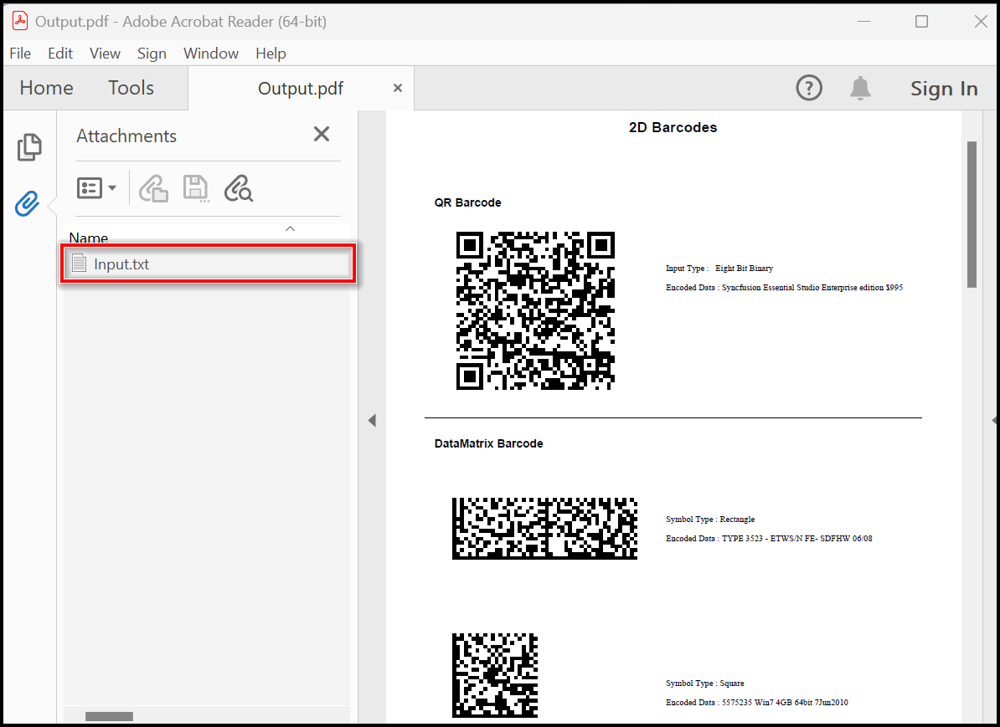
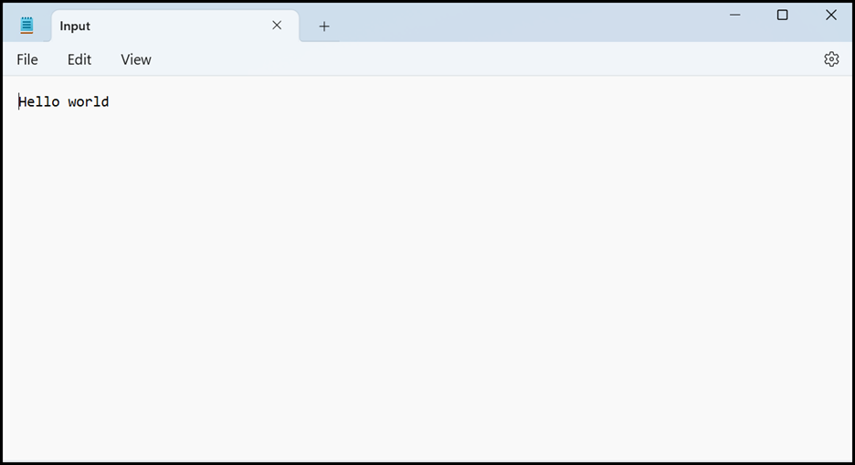
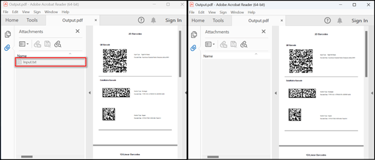

# Add and Remove Attachments in PDF using C#

The [Syncfusion&reg; .NET PDF Library](https://www.syncfusion.com/document-processing/pdf-framework/net/pdf-library) provides support for file attachments in PDF documents, allowing developers to add attachments to a PDF document from within their application code. The library also provides APIs for extracting attachments from PDF documents, as well as for modifying and deleting existing attachments.

This article will cover the process to add, extract and remove file attachments from a PDF document using the Syncfusion&reg; .NET PDF library. The topics related to this will be discussed in the following sections of this post:

Name | Description
--- | ---
[Add an attachment](https://github.com/SyncfusionExamples/create-pdf-attachments-csharp/tree/master/AddAttachmentPDF) | It refers to the process of embedding a separate file, such as a text document, image, or audio file, into a PDF document.
[Extracte and save an attachment](https://github.com/SyncfusionExamples/create-pdf-attachments-csharp/tree/master/ExtractAttachmentPDF) | It refers to the process of removing or separating a file or document that is embedded or attached within a PDF document and saving it as a separate file on your computer or device.
[Remove an attachment](https://github.com/SyncfusionExamples/create-pdf-attachments-csharp/tree/master/RemoveAttachmentPDF) | It useful in cases where the attachment is no longer needed, or when the PDF file needs to be shared without the attached file.

## Add an attachment in a PDF using C#

Adding a file attachment in a PDF document refers to the process of embedding a separate file, such as a text document, image, or audio file, into a PDF document.

The following code example shows how to add an attachment to a PDF file using C#.

```csharp
//Load the PDF document
FileStream docStream = new FileStream("Input.pdf", FileMode.Open, FileAccess.Read);
PdfLoadedDocument loadedDocument = new PdfLoadedDocument(docStream);

//Creates an attachment
Stream fileStream = new FileStream("Input.txt", FileMode.Open, FileAccess.Read);
PdfAttachment attachment = new PdfAttachment("Input.txt", fileStream);
attachment.ModificationDate = DateTime.Now;
attachment.Description = "Input.txt";
attachment.MimeType = "application/txt";

if (loadedDocument.Attachments == null)
    loadedDocument.CreateAttachment();
//Add the attachment to the document
loadedDocument.Attachments.Add(attachment);

//Save the document into stream
using(MemoryStream stream = new MemoryStream())
{
loadedDocument.Save(stream);
}
//Close the document.
loadedDocument.Close(true);
```
By executing this code example, you will get a PDF document like the following screenshot.



## Extracting and saving an attachment to the disk

Extracting and saving attachment in PDF refers to the process of removing or separating a file or document that is embedded or attached within a PDF document and saving it as a separate file on your computer or device.

The following code example shows how to extract attachments from an existing PDF document using C#.

```csharp
FileStream docStream = new FileStream("Input.pdf", FileMode.Open, FileAccess.Read);
PdfLoadedDocument loadedDocument = new PdfLoadedDocument(docStream);

//Iterates the attachments
foreach (PdfAttachment attachment in loadedDocument.Attachments)
{
    //Extracts the attachment and saves it to the disk
    FileStream s = new FileStream(attachment.FileName, FileMode.Create);
    s.Write(attachment.Data, 0, attachment.Data.Length);
    s.Dispose();
}
//Close the document.
loadedDocument.Close(true);

```

By executing this code example, you will get an extracted text file like the following screenshot.




## Removing attachment from an existing PDF
Removing a file attachment from a PDF can be useful in cases where the attachment is no longer needed, or when the PDF file needs to be shared without the attached file.

The following code example shows how to remove an attachment from an existing PDF document using C#.

```csharp
/Load the PDF document 
PdfLoadedDocument loadedDocument = new PdfLoadedDocument(docStream); 

//Removes an attachment 
PdfAttachmentCollection attachments = loadedDocument.Attachments; 
attachments.RemoveAt(0); 
attachments.Remove(attachments[0]); 
attachments.Clear(); 

FileStream stream = new FileStream("output.pdf", FileMode.Create); 
//Save the modified document to file. 
loadedDocument.Save(stream); 
//Close the PDF document. 
loadedDocument.Close(true); 
stream.Close(); 
```

By executing this code example, you will get a PDF document like the following screenshot.



# How to run the examples
* Download this project to a location in your disk. 
* Open the solution file using Visual Studio. 
* Rebuild the solution to install the required NuGet package. 
* Run the application.

# Resources
*   **Product page:** [Syncfusion&reg; PDF Framework](https://www.syncfusion.com/document-processing/pdf-framework/net)
*   **Documentation page:** [Syncfusion&reg; .NET PDF library](https://help.syncfusion.com/file-formats/pdf/overview)
*   **Online demo:** [Syncfusion&reg; .NET PDF library - Online demos](https://ej2.syncfusion.com/aspnetcore/PDF/CompressExistingPDF#/bootstrap5)
*   **Blog:** [Syncfusion&reg; .NET PDF library - Blog](https://www.syncfusion.com/blogs/category/pdf)
*   **Knowledge Base:** [Syncfusion&reg; .NET PDF library - Knowledge Base](https://www.syncfusion.com/kb/windowsforms/pdf)
*   **EBooks:** [Syncfusion&reg; .NET PDF library - EBooks](https://www.syncfusion.com/succinctly-free-ebooks)
*   **FAQ:** [Syncfusion&reg; .NET PDF library - FAQ](https://www.syncfusion.com/faq/)

# Support and feedback
*   For any other queries, reach our [Syncfusion&reg; support team](https://www.syncfusion.com/support/directtrac/incidents/newincident?utm_source=github&utm_medium=listing&utm_campaign=github-docio-examples) or post the queries through the [community forums](https://www.syncfusion.com/forums?utm_source=github&utm_medium=listing&utm_campaign=github-docio-examples).
*   Request new feature through [Syncfusion&reg; feedback portal](https://www.syncfusion.com/feedback?utm_source=github&utm_medium=listing&utm_campaign=github-docio-examples).

# License
This is a commercial product and requires a paid license for possession or use. Syncfusion’s licensed software, including this component, is subject to the terms and conditions of [Syncfusion's EULA](https://www.syncfusion.com/eula/es/?utm_source=github&utm_medium=listing&utm_campaign=github-docio-examples). You can purchase a licnense [here](https://www.syncfusion.com/sales/products?utm_source=github&utm_medium=listing&utm_campaign=github-docio-examples) or start a free 30-day trial [here](https://www.syncfusion.com/account/manage-trials/start-trials?utm_source=github&utm_medium=listing&utm_campaign=github-docio-examples).

# About Syncfusion&reg;
Founded in 2001 and headquartered in Research Triangle Park, N.C., Syncfusion&reg; has more than 26,000+ customers and more than 1 million users, including large financial institutions, Fortune 500 companies, and global IT consultancies.

Today, we provide 1600+ components and frameworks for web ([Blazor](https://www.syncfusion.com/blazor-components?utm_source=github&utm_medium=listing&utm_campaign=github-docio-examples), [ASP.NET Core](https://www.syncfusion.com/aspnet-core-ui-controls?utm_source=github&utm_medium=listing&utm_campaign=github-docio-examples), [ASP.NET MVC](https://www.syncfusion.com/aspnet-mvc-ui-controls?utm_source=github&utm_medium=listing&utm_campaign=github-docio-examples), [ASP.NET WebForms](https://www.syncfusion.com/jquery/aspnet-webforms-ui-controls?utm_source=github&utm_medium=listing&utm_campaign=github-docio-examples), [JavaScript](https://www.syncfusion.com/javascript-ui-controls?utm_source=github&utm_medium=listing&utm_campaign=github-docio-examples), [Angular](https://www.syncfusion.com/angular-ui-components?utm_source=github&utm_medium=listing&utm_campaign=github-docio-examples), [React](https://www.syncfusion.com/react-ui-components?utm_source=github&utm_medium=listing&utm_campaign=github-docio-examples), [Vue](https://www.syncfusion.com/vue-ui-components?utm_source=github&utm_medium=listing&utm_campaign=github-docio-examples), and [Flutter](https://www.syncfusion.com/flutter-widgets?utm_source=github&utm_medium=listing&utm_campaign=github-docio-examples)), mobile ([Xamarin](https://www.syncfusion.com/xamarin-ui-controls?utm_source=github&utm_medium=listing&utm_campaign=github-docio-examples), [Flutter](https://www.syncfusion.com/flutter-widgets?utm_source=github&utm_medium=listing&utm_campaign=github-docio-examples), [UWP](https://www.syncfusion.com/uwp-ui-controls?utm_source=github&utm_medium=listing&utm_campaign=github-docio-examples), and [JavaScript](https://www.syncfusion.com/javascript-ui-controls?utm_source=github&utm_medium=listing&utm_campaign=github-docio-examples)), and desktop development ([WinForms](https://www.syncfusion.com/winforms-ui-controls?utm_source=github&utm_medium=listing&utm_campaign=github-docio-examples), [WPF](https://www.syncfusion.com/wpf-ui-controls?utm_source=github&utm_medium=listing&utm_campaign=github-docio-examples), [WinUI(Preview)](https://www.syncfusion.com/winui-controls?utm_source=github&utm_medium=listing&utm_campaign=github-docio-examples), [Flutter](https://www.syncfusion.com/flutter-widgets?utm_source=github&utm_medium=listing&utm_campaign=github-docio-examples) and [UWP](https://www.syncfusion.com/uwp-ui-controls?utm_source=github&utm_medium=listing&utm_campaign=github-docio-examples)). We provide ready-to-deploy enterprise software for dashboards, reports, data integration, and big data processing. Many customers have saved millions in licensing fees by deploying our software.
